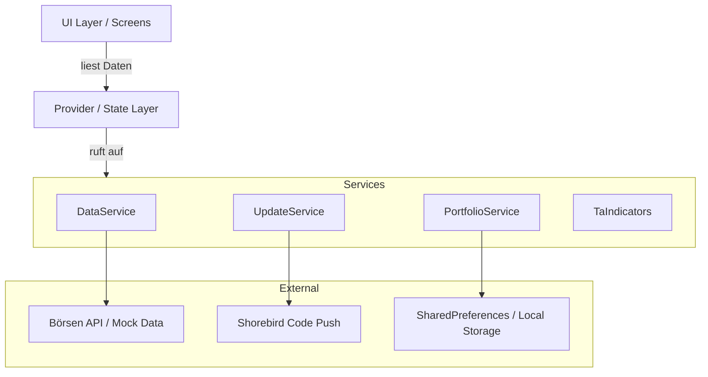

# 🛠 TechAna Developer API & Architecture

> **Version:** 1.0.0
> **Stand:** Februar 2026

Diese Dokumentation richtet sich an Entwickler, die TechAna erweitern, warten oder die zugrundeliegende Architektur verstehen möchten. Sie behandelt die Service-Struktur, Datenmodelle und den Workflow für Updates via Shorebird.

---

## 🏗 Architektur-Übersicht

TechAna basiert auf **Flutter** und folgt einer strengen **Service-orientierten Architektur (SOA)** in Kombination mit dem **Provider-Pattern** für State Management.

### High-Level Diagramm



---

## 🧩 Kern-Services (`lib/services/`)

Die App-Logik ist in isolierte Services gekapselt, die als Singletons oder via `Provider` instanziiert werden.

### 1. `DataService`

Der zentrale Hub für Marktdaten. Er abstrahiert die Datenquelle, sodass zwischen Live-API und Test-Daten gewechselt werden kann.

* **Verantwortlichkeit:** Abruf von Kerndaten (Preise, Volumen, Metadaten).
* **Wichtige Methoden:**
* `getMarketData(String symbol)`: Liefert eine Liste von `Candle`-Objekten für Charts.
* `searchAssets(String query)`: Sucht nach Aktien/Krypto-Paaren.
* `getCompanyProfile(String symbol)`: Lädt fundamentale Daten für die Analyse.


### 2. `PortfolioService` (`ChangeNotifier`)

Verwaltet den lokalen Zustand des Nutzer-Portfolios. Da dieser Service ein `ChangeNotifier` ist, können UI-Komponenten direkt auf Änderungen hören.

* **Verantwortlichkeit:** Kaufen/Verkaufen-Logik, Balance-Tracking, Transaktionshistorie.
* **Wichtige Methoden:**
* `executeTrade(TradeRecord trade)`: Validiert und speichert eine Transaktion.
* `resetPortfolio()`: Setzt das Portfolio auf den Startwert (Paper Trading) zurück.
* `get holdings`: Getter für aktuelle Positionen.


### 3. `TaIndicators` (Statische Helper)

Eine reine Dart-Bibliothek für mathematische Berechnungen. Dieser Service ist zustandslos (stateless).

* **Verantwortlichkeit:** Berechnung technischer Indikatoren aus Rohdaten.
* **Implementierte Indikatoren:**
* `calculateSMA(prices, period)`: Simple Moving Average.
* `calculateRSI(prices, period)`: Relative Strength Index.
* `calculateMACD(...)`: Moving Average Convergence Divergence.
* `calculateBollingerBands(...)`: Standardabweichungskanäle.


### 4. `UpdateService` (Shorebird Integration)

Handhabt Over-the-Air (OTA) Updates, um Bugfixes ohne App-Store-Review auszuspielen.

* **Tech-Stack:** [Shorebird](https://shorebird.dev)
* **Workflow:**
1. App startet -> `checkForUpdate()` wird im Hintergrund aufgerufen.
2. Wenn Patch verfügbar -> Download via `shorebird_code_push`.
3. Neustart -> App läuft mit neuem Code.


---

## 📦 Datenmodelle (`lib/models/`)

### `Asset`

Repräsentiert ein handelbares Instrument.

```dart
class Asset {
  final String symbol;      // z.B. "AAPL", "BTC-USD"
  final String name;        // z.B. "Apple Inc."
  final double currentPrice;
  final double change24h;   // Prozentuale Änderung
  // ...
}

```

### `TradeRecord`

Dokumentiert eine abgeschlossene Transaktion.

```dart
class TradeRecord {
  final String id;
  final String assetSymbol;
  final TradeType type;     // TradeType.buy oder TradeType.sell
  final double amount;      // Anzahl der Stücke
  final double priceAtTrade;
  final DateTime timestamp;
}

```

### `Candle`

Ein einzelner Datenpunkt im Chart (OHLCV).

* `open`, `high`, `low`, `close` (Preise)
* `volume` (Handelsvolumen)
* `timestamp` (Zeitstempel der Kerze)

---

## 🔌 Guide: Integration neuer Indikatoren

Möchtest du einen eigenen Indikator (z.B. *Stochastic Oscillator*) hinzufügen? Folge diesem Prozess:

### Schritt 1: Logik implementieren

Öffne `lib/services/ta_indicators.dart` und erstelle eine statische Methode.

```dart
// lib/services/ta_indicators.dart

static List<double> calculateStochastic(List<double> closes, List<double> lows, List<double> highs, int period) {
  List<double> result = [];
  // 1. Iteriere durch die Daten
  // 2. Finde Lowest Low und Highest High der Periode
  // 3. Berechne %K = (Current Close - Lowest Low) / (Highest High - Lowest Low) * 100
  return result;
}

```

### Schritt 2: Ergebnis-Modell erweitern (Optional)

Falls der Indikator komplexe Werte zurückgibt (z.B. MACD mit Signal-Line), erweitere `IndicatorResult` in `lib/models/models.dart`.

### Schritt 3: UI-Integration

Registriere den Indikator im `AnalysisStatsScreen` (`lib/ui/analysis_stats_screen.dart`), damit er berechnet und angezeigt wird.

```dart
// lib/ui/analysis_stats_screen.dart

// Innerhalb der build-Methode oder initLogic:
final stochData = TaIndicators.calculateStochastic(
  candles.map((c) => c.close).toList(),
  candles.map((c) => c.low).toList(),
  candles.map((c) => c.high).toList(),
  14 // Periode
);

// Widget hinzufügen:
IndicatorCard(
  title: "Stochastic (14)",
  value: stochData.last.toStringAsFixed(2),
  status: stochData.last > 80 ? "Overbought" : "Neutral",
),

```

---

## 🚀 Build & Deployment (Shorebird)

TechAna nutzt Shorebird für sofortige Updates.

### Release erstellen (Initial)

Wenn eine neue native Version (neue Dependencies, Icon-Änderungen) nötig ist:

```bash
shorebird release android
# oder
shorebird release ios

```

Dies erstellt eine `.aab` / `.ipa`, die in den App Store hochgeladen werden muss.

### Patch senden (Hotfix)

Um reinen Dart-Code (Logik, UI-Fehler) zu fixen:

```bash
shorebird patch android

```

Dieser Befehl lädt den geänderten Code hoch. Benutzer erhalten das Update beim nächsten App-Start automatisch.

---

## ❓ FAQ für Entwickler

**F: Wo finde ich die API-Keys?**
A: API-Keys (für AlphaVantage, CoinGecko etc.) sollten in einer `.env` Datei im Root-Verzeichnis liegen und nicht ins Git gepusht werden. Siehe `.env.example`.

**F: Wie setze ich die App komplett zurück?**
A: In den Einstellungen gibt es einen "Factory Reset" Button, oder du löschst den App-Storage über die System-Einstellungen deines Emulators.

```

```